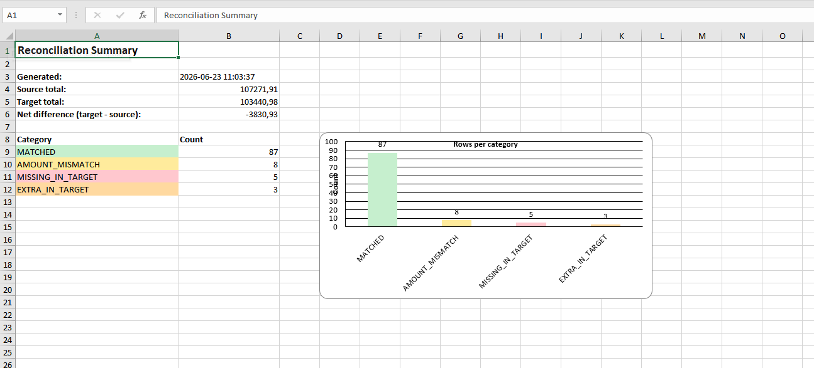

# Excel Reconciliation Tool

> A Python CLI that compares two Excel files by a key column, flags every discrepancy, and generates a formatted, colour-coded Excel report with summary stats and a chart.

Reconcile **CRM orders vs. bank payments** (or any two tabular exports) in one command — no manual VLOOKUPs, no eyeballing rows.



---

## Features

- 🔍 **Four-way categorisation** — every row is tagged `MATCHED`, `AMOUNT_MISMATCH`, `MISSING_IN_TARGET`, or `EXTRA_IN_TARGET`.
- 🎨 **Colour-coded report** — green / yellow / red / orange highlights, one sheet per category.
- 📊 **Summary sheet** — counts per category, total amount difference, timestamp, and an embedded bar chart.
- 💸 **Amount tolerance** — configurable threshold absorbs rounding/floating-point noise so real mismatches stand out.
- ⚙️ **Works on any dataset** — key column, amount column, and tolerance are all CLI arguments.
- 🧾 **Side-by-side amounts** — mismatch rows show source vs. target amount plus the signed difference.

---

## Installation

```bash
pip install -r requirements.txt
```

Requires **Python 3.10+**.

---

## Usage

```bash
python reconcile.py \
  --source sample_data/crm_orders.xlsx \
  --target sample_data/bank_payments.xlsx \
  --key order_id \
  --output sample_data/reconciliation_report.xlsx
```

Optional arguments:

| Argument        | Default  | Description                                        |
|-----------------|----------|----------------------------------------------------|
| `--amount-col`  | `amount` | Numeric column compared for matched keys.          |
| `--tolerance`   | `0.01`   | Max absolute amount gap still treated as a match.  |

Regenerate the sample data set at any time:

```bash
python generate_sample_data.py
```

---

## Sample Output

The generated `reconciliation_report.xlsx` contains five sheets:

| Sheet         | Contents                                                                 |
|---------------|--------------------------------------------------------------------------|
| **Summary**   | Counts per category, source/target totals, net difference, bar chart.    |
| **Matched**   | Rows present in both files with equal amounts *(green)*.                  |
| **Mismatches**| Rows present in both files with differing amounts, shown side by side *(yellow)*. |
| **Missing**   | Rows in the source but absent from the target *(red)*.                    |
| **Extra**     | Rows in the target with no matching source row *(orange)*.               |

---

## Tech Stack

- **Python 3.10+**
- **pandas** — data loading, merging, comparison
- **openpyxl** — formatted multi-sheet workbook, highlighting, embedded chart
- **Faker** — realistic sample data generation

---

## License

Released under the [MIT License](LICENSE).
